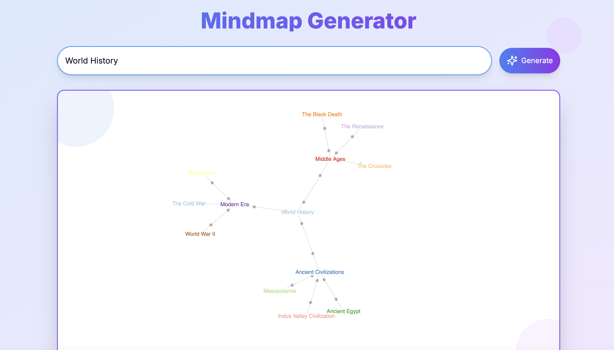

# Mindmap Generator

## Description

Mindmap Generator is a dynamic web application that creates visual mindmaps based on user-input topics. It leverages AI to generate comprehensive, hierarchical representations of ideas, making it an excellent tool for brainstorming, studying, or organizing thoughts.



## Features

- **AI-Powered Mindmap Generation**: Enter any topic, and the app will create a detailed mindmap.
- **Interactive UI**: Smooth animations and transitions for an engaging user experience.
- **Responsive Design**: Works well on both desktop and mobile devices.
- **Error Handling**: Provides clear feedback and troubleshooting steps if issues occur.
- **Real-time Loading Indicator**: Animated "cooking" state while the mindmap is being generated.

## Technology Stack

- **Frontend**: React with Next.js (App Router)
- **Language**: TypeScript
- **Styling**: Tailwind CSS
- **Animations**: Framer Motion
- **Icons**: Lucide React
- **API**: Next.js API Routes
- **Visualization**: D3.js

## Installation

1. Clone the repository:
   ```
   git clone https://github.com/satvik314/ai-mindmaps.git
   ```

2. Navigate to the project directory:
   ```
   cd ai-mindmaps
   ```

3. Install dependencies:
   ```
   npm install
   ```

4. Set up environment variables:
   Create a `.env.local` file in the root directory and add `GROQ_API_KEY`

5. Run the development server:
   ```
   npm run dev
   ```

6. Open [http://localhost:3000](http://localhost:3000) in your browser to see the application.

## Usage

1. Enter a topic in the input field.
2. Click the "Generate" button or press Enter.
3. Wait for the mindmap to be generated.
4. Explore the generated mindmap.

## API Routes

- `/api/generate-mindmap`: POST request to generate a mindmap based on the provided topic.

## Components

- `Page`: Main component that handles the UI and state management.
- `MindMap`: Component responsible for rendering the generated mindmap.

## Styling

The application uses Tailwind CSS for styling, with custom gradients and animations for a modern, engaging look. Special attention has been given to color contrast to ensure readability and accessibility:

- The main content uses dark text on light backgrounds for optimal readability.
- The mindmap component uses a color scheme that ensures sufficient contrast between nodes and connections.
- Interactive elements like buttons have distinct hover and active states for better user feedback.

If you notice any issues with color contrast, please report them in the issues section of this repository.

## Error Handling

The app provides detailed error messages and troubleshooting steps if an issue occurs during mindmap generation.

## Performance Considerations

- The app uses React's `useState` for state management.
- Framer Motion is used for animations, which are optimized for performance.
- API calls are made only when the user submits a topic, preventing unnecessary server load.

## Future Enhancements

- Add the ability to save and share generated mindmaps.
- Implement user authentication for personalized experiences.
- Add more customization options for mindmap appearance.
- Integrate with note-taking or project management tools.

## Contributing

Contributions are welcome! Please feel free to submit a Pull Request.

## Contact

Satvik - satvik@buildfastwithai.com
